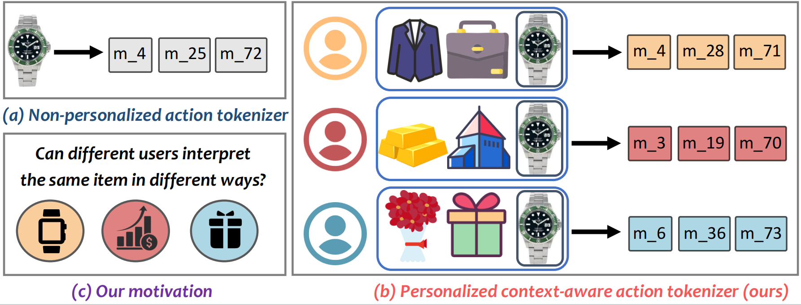
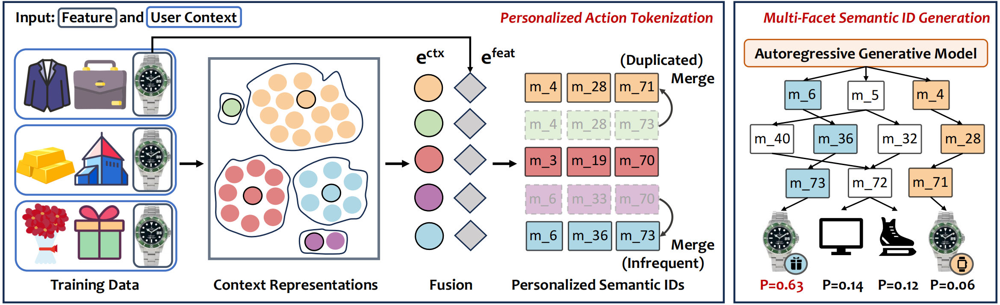

# Pctx

PyTorch-based open-source code for paper "Pctx: Tokenizing Personalized Context for Generative Recommendation".

We suggest running our code on two GPUs, each with at least 24GB of memory.

after choosing a specific dataset,

* If you want to reproduce our results directly (test only), please follow *Part 1: Step0 -> Step1 -> Step2*.
* If you want to run the codes of Pctx for training, please follow *Part 2: Step0 -> Step1 (you may skip) -> Step2 -> Step3*.

<div  align="center">

</div>

<div  align="center">

</div>

## Part 1. Test Pctx only, in order to reproduce our results directly

To directly reproduce our results, please follow the steps outlined below.

Please note that results may vary slightly depending on the environment (e.g., differences in GPUs), and thus, may exhibit minor discrepancies when compared to those reported in our paper.

**Step0: preparation**

for environment:

```bash
pip install -r requirements.txt
```

**Step1: download our ckpt and sem_ids file**

Please download our ckpt and sem_ids file from [ckpt and sem_ids file via google drive](https://drive.google.com/drive/folders/1My_o3bfrZ34jM_SP5UhhDDp_CGTr9b1q?usp=sharing)

Place the `test_file_dir` folder into the `Pctx/` directory, ensuring it is located in the same directory as the `.sh` files.

**Step2: test on GR task**

* Musical_Instruments

```bash
bash test_instrument.sh
```

* Industrial_and_Scientific

```bash
bash test_scientific.sh
```

* Video_Games

```bash
bash test_game.sh
```

## Part2. Train Pctx from scratch

**Step0: preparation**

for environment:

```bash
pip install -r requirements.txt
```

**Step1: for pre-trained neural module (you may skip)**

As described in our paper, we need to get encoded user context representation from an auxiliary model (neural module), such as DuoRec.

Before getting the representation, we need to train such an auxiliary model (neural module).

In this step, we provide codes for you to train such an auxiliary model (e.g., DuoRec).

You could run

```bash
bash train_pretrained.sh
```

to train the model, and get its ckpt for 'train_upstream_{datasetName}.sh'.

We have already prepared the three ckpts on three datasets for your convenience at `Duorec_pretrained_Emb` folder.

***If you do not want to train such a new auxiliary from scratch, please skip this step by using the ckpts we provide.***


**Step2: for upstream**

Related parameters are in `genrec/models/Pctx/config_upstream.yaml`. The most related parameters are in the `.sh` file. We have already set the parameters to appropriate values.

As described in our paper, we need to get encoded user context representation from an auxiliary model (neural module), such as DuoRec.

In this step, we provide codes for you to get encoded user context representation from the well-trained auxiliary model, and cluster them into centroids. This process is defined as upstream.

* Musical_Instruments

```bash
bash train_upstream_instrument.sh
```

* Industrial_and_Scientific

```bash
bash train_upstream_scientific.sh
```

* Video_Games

```bash
bash train_upstream_game.sh
```

**Step3: for GR task**

Related parameters are in `genrec/models/Pctx/config.yaml` and `genrec/models/default.yaml`. The most related parameters are in the `.sh` file. We have already set the parameters to appropriate values.

* Musical_Instruments

```bash
bash train_instrument.sh
```

* Industrial_and_Scientific

```bash
bash train_scientific.sh
```

* Video_Games

```bash
bash train_game.sh
```
