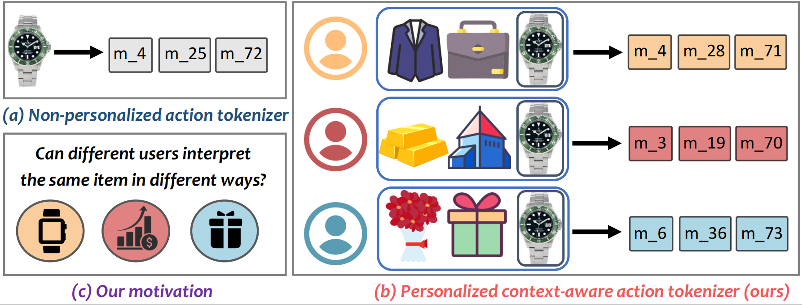
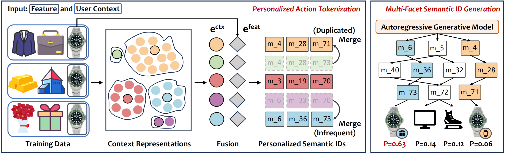

# Pctx

This repository provides the pyTorch-based open-source code for implementing Pctx described in our paper
**<a href="https://arxiv.org/abs/2510.21276" target="_blank">Pctx: Tokenizing Personalized Context for Generative Recommendation</a>**.

We suggest running our code on 2 GPUs, each with at least 24GB of memory.

After choosing a specific dataset,

* If you want to reproduce our results directly (test only), please follow *Part 1: Step0 -> Step1 -> Step2*.
* If you want to run the codes of Pctx for training (including training, validating and testing), please follow *Part 2: Step0 -> Step1 (you may skip) -> Step2 -> Step3*.

<div  align="center">

</div>

<div  align="center">

</div>

## Part 1. Test Pctx only, in order to reproduce our results directly

To directly reproduce our results, please follow the steps outlined below.

Please note that results may vary slightly depending on the environment (e.g., differences in GPUs), and thus, may exhibit minor discrepancies when compared to those reported in our paper.

**Step0: preparation**

for environment (python==3.9.23):

```bash
pip install -r requirements.txt
```

**Step1: download our ckpt and sem_ids file**

Please download our ckpt and sem_ids file from <a href="https://drive.google.com/drive/folders/1My_o3bfrZ34jM_SP5UhhDDp_CGTr9b1q?usp=sharing" target="_blank">test_file_dir via google drive</a>.

Place the `test_file_dir` folder into the `Pctx/` directory, ensuring it is located in the same directory as the `.sh` files.

**Step2: test on GR task**

* Musical_Instruments

```bash
bash test_instrument.sh
```

* Industrial_and_Scientific

```bash
bash test_scientific.sh
```

* Video_Games

```bash
bash test_game.sh
```

## Part2. Train Pctx from scratch

**Step0: preparation**

for environment (python==3.9.23):

```bash
pip install -r requirements.txt
```

This step is exactly the same as Part 1, Step 0. If you have already done that, please skip this step.

**Step1: for pre-trained neural model (you may skip)**

As described in our paper, we need to get encoded user context representation from an auxiliary model (neural model), such as DuoRec.

Before getting the representation, we need to train such an auxiliary model (neural model).

In this step, we provide codes for you to train such an auxiliary model (e.g., DuoRec).

You could run

```bash
bash train_pretrained.sh
```

to train the neural model, and get the corresponding `.pth` file for 'train_upstream_{datasetName}.sh'.

We have already prepared the three `.pth` files on three datasets for your convenience at `pretrained_auxiliary_model_DuoRec` folder.

***If you do not want to train such a new auxiliary model from scratch, please skip this step by using the .pth files we provide.***


**Step2: for upstream**

Related parameters are in `genrec/models/Pctx/config_upstream.yaml`. The most related parameters are in the `.sh` file. We have already set the parameters to appropriate values.

As described in our paper, we need to get encoded user context representation from an auxiliary model (neural model), such as DuoRec.

In this step, we provide codes for you to get encoded user context representation from the pretrained neural model (the pretrained neural model is done in Part 2, Step 1), and cluster them into centroids. This process is defined as *upstream*.

* Musical_Instruments

```bash
bash train_upstream_instrument.sh
```

* Industrial_and_Scientific

```bash
bash train_upstream_scientific.sh
```

* Video_Games

```bash
bash train_upstream_game.sh
```

**Step3: for GR task**

Related parameters are in `genrec/models/Pctx/config.yaml` and `genrec/models/default.yaml`. The most related parameters are in the `.sh` file. We have already set the parameters to appropriate values.

In this step, we provide codes for you to train Pctx on the generative recommendation task.

* Musical_Instruments

```bash
bash train_instrument.sh
```

* Industrial_and_Scientific

```bash
bash train_scientific.sh
```

* Video_Games

```bash
bash train_game.sh
```


## Citing this work

Please cite the following paper if you find our code, processed datasets, or tokenizers etc. helpful.

```
@article{zhong2025pctx,
  title={Pctx: Tokenizing Personalized Context for Generative Recommendation},
  author={Zhong, Qiyong and Su, Jiajie and Ma, Yunshan and McAuley, Julian and Hou, Yupeng},
  journal={arXiv preprint arXiv:2510.21276},
  year={2025}
}
```